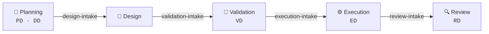

<div align="center">

# ⬡ Directive Framework

**A clean-canon, phase-gated operating system for agent-assisted software delivery.**

Turn an idea into reviewed work through explicit, inspectable artifacts — not conversational promises.

[](https://github.com/AgenticFrameworks/directive-framework/actions/workflows/test.yml)
[](.claude-plugin/plugin.json)
[](LICENSE)
[](tools/)
[](tools/)

</div>

---

## The pipeline

Five phases, each separated by a **deterministic, fail-closed intake gate**. Work only crosses a
boundary when the gate passes — nothing downstream is built on an unverified artifact.



Every gate returns a hard verdict: **`0` PASS** / **`1` BOUNCE** (fix the artifacts and re-run) /
**`2` BLOCK** (canon or cursor error — stop, never force past it).

## What it provides

- A five-phase artifact pipeline: **Planning → Design → Validation → Execution → Review**.
- Paired reasoning/decision packets (`PD` / `DD`), validated build plans (`VD`), execution
  directives (`ED`), and review directives (`RD`).
- Deterministic phase-intake gates, fail-closed lifecycle controls, cursor ownership, and a
  **mechanical executor** — no model is ever in the apply loop.
- **Canon/runtime separation:** reusable framework canon stays clean; every consumer owns its
  own `_directives/` runtime state.
- Built-in review and intent-drift protocols, plus a reproducible, allowlisted release check.
- **Four native surfaces:** a Claude Code plugin, a portable skill, a pi agent package, and an
  interactive planning cockpit (see below).

## Surfaces

| Surface | Path | Install |
|---|---|---|
| 🔌 **Claude Code plugin** | `.claude-plugin/`, `commands/`, `skills/` | `claude plugin marketplace add <repo>` → `claude plugin install directive-framework@directive-framework` — adds the `/ed` and `/directives` commands plus a discovery skill |
| 📦 **Portable skill** | `portable/ed/` | copy `SKILL.md` + canon into any skill-aware agent |
| 🧩 **pi agent package** | `pi/` | `pi install git:github.com/daedalusos/directive-framework` |
| 🖥️ **Planning cockpit** | `cockpit/` | `python3 cockpit/server/app.py` — serves the UI **and** its `/api` backend |

The **pi package** is the native fusion: a pi extension (`pi/extensions/directives.ts`) registers
`directive_*` tools, a `/directives` command, per-turn phase-context injection, and a fail-closed
write gate over `write`/`edit`/`bash` redirect targets; a deterministic runtime
(`pi/runtime/directives-runtime.mjs`) owns every cursor/registry/gate mutation. See `pi/README.md`
and `pi/INSTALL.md`.

## 🖥️ Planning cockpit

The cockpit is an interactive **front door** to the pipeline: converse to converge on scope, then
accept a settled decision — which is written as a **gate-passing `PD` ⇄ `DD` pair** straight into a
project's `_directives/`, with the real `design-intake` gate one click away.

```bash
# serves UI + API on one origin; open the printed http://localhost:PORT/
python3 cockpit/server/app.py --project /path/to/project
```

A thin static frontend sits over a stdlib-only backend (`cockpit/server/app.py`) that owns every
runtime write and shells out to the canon gate-runner. `/api/chat` routes through Perplexity Sonar
or OpenRouter (a provider key is needed **only** for chat; the accept → settle → gate flow works
without one). Full detail: [`cockpit/README.md`](cockpit/README.md).

## Quick start

Clone the repo, then initialize runtime state in the project you want to operate on:

```bash
python3 /path/to/directive-framework/tools/init-runtime.py --project /path/to/project
python3 /path/to/directive-framework/tools/gate-runner.py \
    --validate-templates /path/to/directive-framework/gates
```

> [!IMPORTANT]
> Runtime packets, cursor state, registry history, metrics, and dashboards belong in the
> **consuming project's** `_directives/` directory. They are never part of this framework's
> deliverable canon.

## Core commands

```bash
# Validate all phase-gate contracts (the tracked canon regression suite)
bash tests/test-canon.sh

# Build a clean, reproducible release artifact and print its SHA-256
python3 tools/package-release.py

# Run a phase-boundary intake gate against a project
python3 tools/gate-runner.py gates/design-intake.md --project /path/to/project

# Run a greenlit execution directive (mechanical, idempotent)
bash tools/executor-run.sh ED-NNN --project /path/to/project
```

## Repository layout

| Path | Purpose |
|---|---|
| `planning-directives/` | `PD`/`DD` packet contracts and the planning protocol |
| `design-directives/` | Design-phase notes and UI concepts |
| `validation-directives/` | `VD` packet contract and validation protocol |
| `execution-directives/` | `ED` templates, lifecycle tools, and execution contract |
| `review-directives/` | `RD` packet contract and review protocol |
| `gates/` | Machine-readable phase-boundary gate specifications |
| `tools/` | Deterministic runtime, validation, executor, and release tools |
| `cockpit/` | Interactive planning cockpit (web UI + `/api` backend) |
| `commands/` | Claude Code slash commands (`/ed`, `/directives`) |
| `skills/` | Claude Code discovery skill |
| `.claude-plugin/` | Claude Code plugin + marketplace manifests |
| `portable/` | Standalone skill bundle for any skill-aware agent |
| `pi/` | Native pi agent package (extension + runtime + skill) |
| `hooks/` | Git pre-commit guard + installer |
| `tests/` | Tracked canon regression checks |

**Key specs:** [`RUNTIME-SPEC.md`](RUNTIME-SPEC.md) ·
[`gates/GATES-SPEC.md`](gates/GATES-SPEC.md) ·
[`execution-directives/EXECUTION-SPEC.md`](execution-directives/EXECUTION-SPEC.md) ·
[`EXECUTOR-SPEC.md`](EXECUTOR-SPEC.md) · [`AUTO-HANDOFF-SPEC.md`](AUTO-HANDOFF-SPEC.md)

## Guarantees and limits

The framework **mechanically** validates schema, lifecycle, packet coverage, ordering, and gate
contracts. It does **not** claim that a reviewer's semantic conclusion or a recorded session
identity is cryptographic proof of independent reasoning — those remain auditable review
responsibilities.

## Release and quality

The tracked test suite validates all gate templates, compiles the tools, and enforces canon purity.
The release builder (`tools/package-release.py`) produces an allowlisted archive that excludes
project runtime, credentials, handoffs, and local build artifacts; the archive version is read from
`.claude-plugin/plugin.json`, so the two never drift.

Releases are tagged `v<version>` on `main`; the canon archive and its SHA-256 are attached to the
GitHub Release. The pi package installs directly from the repo via `pi install` and is not bundled
into the canon archive.

## License

Licensed under the **GNU Affero General Public License v3.0** — see [`LICENSE`](LICENSE).
